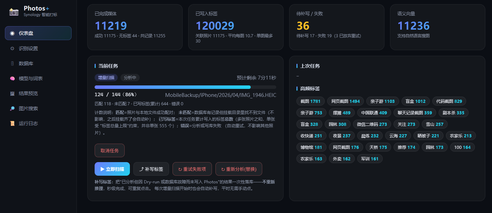

<div align="center">

# Synology Photos+ 📸

**Custom AI auto-tagging for the official Synology Photos app — object detection, Chinese OCR and semantic tags, searchable right inside the official app**

简体中文 · [English](README.en.md) · [中文文档](README.md)



**Once tagged, search directly in the official phone app** — type `dog`, `invoice`,
`sunset at the beach`, `chat screenshot`… Tags are written into the official Synology
Photos database (`general_tag`), so **there is no new app to install and no third-party
service to log into** — the stock Synology Photos app on every family member's phone
finds them instantly.

</div>

---

## ⚠️ Disclaimer (read before use)

1. This project reads/writes the **internal PostgreSQL database** of Synology Photos (`general_tag`, `many_unit_has_many_general_tag`, …) in an **unofficial** way. Synology does not support this; a DSM/Photos major update may change the schema and break it.
2. By using this project you accept that **all database-related risks are your own**. The authors are not liable for data loss, app malfunction, or any consequential damage.
3. Verify the automatic backup (`config/backups/`) succeeded before the first write, and know how to restore.
4. For personal learning and self-hosting only. Not for commercial use (some bundled model licenses have restrictions, see License).
5. Not affiliated with Synology Inc.

## Features

| | |
|---|---|
| 📱 **Searchable in the official app** | Tags are written straight into the official database — **open Synology Photos on any device logged into the NAS and search**, shared with the whole family |
| 🔍 **Object detection** | YOLOv8 (ONNX, COCO-80, bilingual tags) |
| 🧠 **Semantic tags** | Chinese-CLIP ViT-L zero-shot tagging with an **editable 466-tag Chinese vocabulary** (aligned with mainstream phone gallery taxonomies) |
| 📅 **Time & location tags** | "2024年" / "夏季" / city & province names (from EXIF and Synology's own geocoding) / camera model — metadata-only, zero extra cost |
| 📝 **Chinese OCR** | RapidOCR (PP-OCRv4 ONNX): invoice numbers, receipts, chat screenshots — all searchable |
| 🔎 **Semantic image search** | Natural-language image search ("sunset at the beach", "invoice") — Immich-style, powered by CLIP embeddings |
| 🖼 **Live result preview** | Inspect per-photo tags and confidence percentages while scanning; tune thresholds on the fly |
| ♻ **Resumable scans** | Every result is checkpointed to local SQLite first; power loss/restart resumes automatically, never re-runs inference |
| 🛡 **Fault tolerant** | Per-image errors don't stop the job (auto retry); each engine is isolated — failed engines are backfilled automatically; failed DB writes are flushed later |
| 🗄 **Zero-intrusion DB access** | SSH → `sudo -u postgres psql`, **no DSM configuration changes**; automatic `pg_dump` backup before first write |
| 🖥 **Web console** | Dashboard / detection settings / DB diagnostics / model & vocabulary management / backup & restore / logs — vanilla JS, zero external deps |
| 💤 **Memory friendly** | Models unload after each job and after 10 minutes idle; runs comfortably in 10 GB RAM |

## How it works

```
photo dirs (read-only mount) ──→ enumerate synofoto `unit` table + filesystem index/matching
      ──→ inference: YOLOv8 objects + Chinese-CLIP semantic tags + RapidOCR text
      ──→ checkpoint to local SQLite
      ──→ batch write into general_tag / many_unit_has_many_general_tag
      ──→ searchable in the official app (bilingual normalized_name)
```

The three engines have clear roles: **YOLOv8** answers "what objects are in the
frame", **Chinese-CLIP** answers "what scene / what's happening" (the vocabulary
IS the recognition scope, freely editable), and **RapidOCR** extracts "what text
is written" — all merged, deduplicated and written as tags, with CLIP image
embeddings kept for semantic search.

## Proven at scale

Real numbers from the author's long-running DS220+ (dual-core J4025, no GPU):

- **11,000+ photos/videos** tagged with **120,000+ tags** in total
- 10.7 tags per photo on average; 11,000+ semantic vectors powering natural-language search
- Fully offline — photos never leave the NAS

## Deployment (tested target: DS220+, x86_64 without AVX)

```bash
# 1. Put the project at /volume1/docker/synologyPhotosplus
# 2. Adjust the photo bind mounts in docker-compose.yml (source must exist)
cd /volume1/docker/synologyPhotosplus
sudo docker compose up -d --build
```

> **The build downloads no models.** After first start, open the
> **Models & vocabulary** page and click **Download models** (~420 MB,
> sha256-verified; progress streams into the logs). For slow/broken
> Hugging Face access, add `HF_ENDPOINT=https://hf-mirror.com` to the
> environment in `docker-compose.yml`. If you deployed by copying the
> folder, existing `.onnx` files under `app/models/` are used as-is.

Open `http://NAS_IP:47310`:

1. **Database** tab → SSH (host `127.0.0.1`, port 22, an **administrators-group account**) → run "Test connection"
2. Confirm mounts show ✔ (mounting `/volume1/homes` once covers every user; subfolders are discovered automatically)
3. Enable **Dry-run** for the first batch, review tags & confidence in **Result preview**, tune thresholds/vocabulary, then disable Dry-run and use "Write pending tags"
4. Search in the official Photos app: `dog`, `invoice`, `sunset at the beach` …

## Data safety

- Before the first write, every `synofoto*` database is `pg_dump`ed into `config/backups/` (keeps 5); manual backup and in-app restore (with typed confirmation) available
- Only `INSERT`s tags/relations and `UPDATE`s `count`; no other tables are touched. "Re-analyze (replace)" removes only tags **this tool created** — your manual tags are safe
- Manual restore: `gunzip -c backup.sql.gz | sudo -u postgres psql -d <db>` (stop the container first)

## FAQ

- **"psql not found"** — the SSH account must be in the administrators group; several psql paths are probed automatically
- **Too many weak tags** — raise the probability threshold (0.05–0.10) and similarity floor (0.22–0.28); use the confidence percentages in Result preview to tune
- **Different categories** — edit the vocabulary page (`中文,英文`, one per line); new scans pick it up immediately, old photos need "Re-analyze (replace)"
- **Speed expectations** — 5–15 s per photo (3 engines) on the dual-core J4025, so ~1–2 days for 10k photos (unattended; incremental scans afterwards are minute-level); `SP_ORT_THREADS=2`; works without AVX
- **iPhone High-Efficiency format (AV1-HEIF)** — falls back to the Synology-generated thumbnail for analysis; camera RAWs are covered by their JPG pairs, previews use Synology thumbnails

## Credits

Standing on the shoulders of:

| Project | Usage / License |
|---|---|
| [eleonne/synology-tagger](https://github.com/eleonne/synology-tagger) | first proved that writing tag data straight into the Synology Photos database is feasible — the origin of this project's approach |
| [Ultralytics YOLOv8](https://github.com/ultralytics/ultralytics) | object detection model (**AGPL-3.0** — model weights; commercial use requires an Ultralytics license) |
| [RapidOCR](https://github.com/RapidAI/RapidOCR) | Chinese OCR engine & models (Apache-2.0) |
| [Chinese-CLIP](https://github.com/OFA-Sys/Chinese-CLIP) (Alibaba DAMO) | the primary recognition engine (Apache-2.0) |
| [OpenAI CLIP](https://github.com/openai/CLIP) | zero-shot image-text matching paradigm (MIT) |
| [Xenova ONNX exports](https://huggingface.co/Xenova) | ONNX conversions of CLIP / Chinese-CLIP |
| [onnxruntime](https://github.com/microsoft/onnxruntime) | CPU inference (MIT), works without AVX |
| [Tom Select](https://github.com/orchidjs/tom-select) | frontend dropdown component (Apache-2.0, vendored) |
| [Immich](https://github.com/immich-app/immich) | inspiration for semantic search UX |
| [FastAPI](https://github.com/tiangolo/fastapi) / [uvicorn](https://github.com/encode/uvicorn) | web framework (MIT / BSD) |
| Huawei Gallery help docs | reference for the tag taxonomy |

## License

Code released under [MIT](LICENSE). **Note third-party model licenses**: YOLOv8 weights are AGPL-3.0 (commercial use requires an Ultralytics license); Chinese-CLIP and PP-OCR models are Apache-2.0. See the LICENSE footer for details.

---

<div align="center">

**中文文档 → [README.md](README.md)**

</div>
